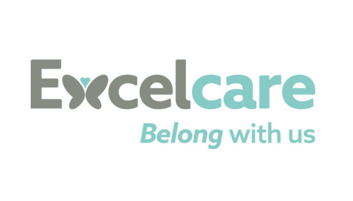
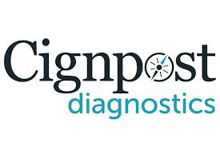
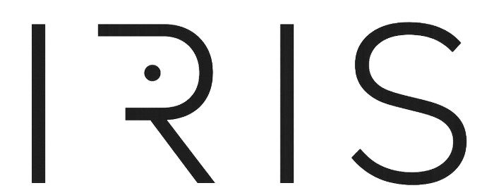

<!-- Header image (optional) -->
<!--  -->

<h1 align="center">Kajan Subakannan</h1>

  Data Engineer & Biomedical-AI Enthusiast · London, UK  
   
  <a href="mailto:kajan2backup@gmail.com">Email</a> ·
  <a href="tel:+447538709083">+44 7538 709083</a> ·
  <a href="https://www.linkedin.com/in/kajan-subakannan-578a16135/">LinkedIn</a> ·
  <a href="https://github.com/KajanGH">GitHub</a>

  <a href="#experience">Experience</a> ·
  <a href="#selected-projects">Projects</a> ·
  <a href="#education">Education</a> ·
  <a href="#skills">Skills</a> ·
  <a href="#awards--accreditations">Awards</a> ·
  <a href="#get-in-touch">Contact</a>

---

## About

---
## Experience
<!-- ----------------------------------------------------------------- -->

### Data Engineer — Excelcare  
Jun 2024 – Present  

- Architected **Azure Data Factory → SQL Server → Power BI** platform ingesting 10+ sources, retiring a £50 k/yr SaaS EHR and delivering **£75 k+ annual savings**.  
- Deployed GBDT models forecasting 7-day occupancy (MAE 4 %) & 48 h medication-anomaly alerts, enabling proactive rota planning.  
- Retrofit of 100+ CTEC800 nurse-call units with Raspberry Pi MQTT gateways halved alert latency and boosted CQC compliance.  

 

---

### Financial Services & Consulting Intern — PwC  
Jul 2023 – Aug 2023  

- Automated cash-flow modelling templates (Python + Excel) for a mock FTSE-250 client, cutting turnaround **25 %**.  
- Queried audit data sets (SQL + pandas) to set materiality thresholds and flag high-risk outliers.  

 

---

### Investment Banking Intern — UBS  
Jul 2023 – Aug 2023  

- Built DCF & trading-comps models for simulated TMT deal; compiled sector briefs feeding MD-level pitchbook.  

 

---

### Data Analyst — Care Optics  
Sep 2019 – Apr 2023  

- Migrated patient records to bespoke MySQL system — monthly reporting time ↓ 15 %, saving £25 k p.a.  
- Automated management-accounts pack via Power Query, accelerating month-end close & audit accuracy.  

 

---

### Shift Manager — Cignpost  
Jul 2021 – Feb 2022  

- Supervised 30 staff & optimised rosters with Excel Solver → queue length ↓ 20 %, staff error rate ↓ 45 %.  

 

---

## Selected Projects

<!-- ─────────────────────────── IRIS ─────────────────────────── -->

  
  <h3>IRIS – Accessible Smart Doorbell</h3>
  
<em>Master's Research Project</em>

  
<em>ML & Systems-Integration Lead · Master’s Research (Oct 2024 – Jun 2025)</em>

  <ul>
    <li>Inclusive hardware + AI design: Pi-based prototype delivers real-time visitor descriptions &amp; RFID ID in a weather-proof PETG housing.</li>
    <li><strong>&lt;1 s</strong> multimodal V-L pipeline (YOLOv8 + GPT-4o) proves low-latency edge analytics feasibility.</li>
    <li>Iterated tactile Braille controls, audio UX &amp; sustainability strategy with RNIB panels — met ISO 24920 accessibility spec.</li>
    <li>Authored a 200-page break-even &amp; LCA report translating architecture into a year-1 profitability case.</li>
    <li>Achieved a First Class result (~79%)</li>
    <li>Nominated for 2 UCL Centre of Engineering Awards for the 'Innovation Award' and 'Best Prototype'</li>
  </ul>

<!-- ─────────────────── Monotone Operator DL for QSM ─────────── -->

  
  <h3>Monotone Operator DL for QSM</h3>
  
<em>Undergraduate Final Research Project</em>

  
<em>Undergrad Researcher · UCL Bioengineering (Sep 2023 – May 2024)</em> ·
     <a href="assets/papers/monotone_qsm.pdf" target="_blank" rel="noopener">View&nbsp;paper (PDF)</a>

  <ul>
    <li>Developed an advanced Python QSM signal model to visualise brain susceptibility in 3-D, revolutionising MRI accuracy.</li>
    <li>Explored optimisation algorithms (gradient descent, conjugate gradients) to improve convex optimisation inside the DL framework.</li>
    <li>Extended the MODL framework to full 3-D reconstruction with parallel computation in PyTorch.</li>
    <li>Tuned hyper-parameters, applied transfer learning &amp; cross-validation for maximal reconstruction fidelity.</li>
    <li>Compiled comprehensive documentation &amp; visuals for future conference presentation.</li>
    <li>Achieved a First Class result (~80%)</li>
  </ul>

<!-- ──────────────── National Demographic Data App ───────────── -->

  <h3>Urban Intelligence – National Demographic Data App</h3>
  
<em>Lead Engineer (Sep 2023 – present)</em>

  <ul>
    <li>Leading a 4-person team building a Python/JS analytics web app and REST API.</li>
    <li>Geo-spatial visualisation &amp; time-series forecasting optimise marketing campaigns.</li>
    <li>REST API exposes datasets &amp; analytics for third-party developers.</li>
  </ul>

<!-- ──────────────────── GreenChain Hackathon ─────────────────── -->

  <h3>GreenChain – Lloyds Bank Reboot Hackathon</h3>
  
<em>Business & Design Lead · Top 5 / 50 teams · Jun 2023</em>

  <ul>
    <li>Conceived SME-focused platform to track &amp; optimise supply-chain emissions for net-zero goals.</li>
    <li>Crafted strategic subscription model with value-added sustainability consulting &amp; audit services.</li>
  </ul>

<!-- ──────────────── HTCTW Air-Pollution Project ─────────────── -->

  <h3>HTCTW – Urban Air-Pollution Solutions</h3>
  
<em>Engineering Design Lead / Creative Lead · Jun 2023</em>

  <ul>
    <li>Designed policy + tech solutions to tackle Delhi crop-burning; completed 100 % of deliverables in 2 weeks with a multi-disciplinary team.</li>
    <li>Collaborated with 15 + policy &amp; industry experts to boost real-world viability.</li>
    <li>Produced posters, infographics &amp; slide-deck (Adobe CC) that earned a top-scoring presentation (> 90 th percentile).</li>
  </ul>

<!-- ────────────── Assistive Myoelectric-Sensor Mouse ─────────── -->

  <h3>Assistive Tech – Myoelectric-Sensor Mouse</h3>
  
<em>Team Lead &amp; Electronics/Coding Lead · Nov 2022</em>

  <ul>
    <li>Invented a device enabling amputees to control a mouse via forearm musculature (sub-350 ms latency).</li>
    <li>Coded C++ firmware for sensor calibration &amp; cursor control, boosting sensitivity 25 %.</li>
    <li>Achieved 35 % faster response than traditional mice; emphasised user-centred ergonomics.</li>
  </ul>

<!-- ─────────── Facial-Recognition Accessibility App ─────────── -->

  <h3>Facial-Recognition App for Visually Impaired</h3>
  
<em>Solo Project · Mar 2022 · MATLAB</em>

  <ul>
    <li>Designed neural-network prototype achieving 95 % facial-recognition accuracy for use with smart doorbells.</li>
    <li>Presented live demo to a large audience, outlining market logistics &amp; business potential.</li>
  </ul>

<!-- /.bento-grid -->

## Education

**University College London (UCL)** — *MEng Biomedical Engineering, First Class Honours*  
**Key quantitative / computing modules**: Computing in Medicine (89 %), Applied Software Engineering (80 %), Applied Programming for Data Science (78 %), ML in Medical Imaging (74 %), Robotic Systems Engineering (72 %), Mathematical Modelling I (68 %)  
**Research emphasis**: Algorithm optimisation & edge‑AI techniques (see *IRIS* & *Monotone Operator Learning*).

---

## Skills

- **Programming / Mark‑up**: Python · SQL · R · MATLAB · C++ · JavaScript · HTML/CSS · Bash · LaTeX  
- **ML / Data Tooling**: PyTorch · TensorFlow · scikit‑learn · pandas · NumPy · SciPy · OpenCV · Statsmodels · Plotly · Seaborn  
- **Data Engineering & BI**: Microsoft SQL Server · PostgreSQL · Power BI · Azure Data Factory · Power Automate · SQLAlchemy/ODBC · REST/JSON APIs · ETL (pandas) · Data Visualisation  
- **Professional & Soft**: Stakeholder communication · Agile (Scrum/Kanban) · Technical writing · Presentation & public speaking · Team leadership · Time management

---

## Awards & Accreditations

- **Chartered Engineer (CEng)** — IET: Professional review submitted; registration pending Q4 2025  
- Nominee – *Best Prototype* & *Best Innovation*, **UCL Engineering CEE Awards 2025**  
- **Conference Keynote**, Excelcare Digital‑Transformation Summit 2025 (AI‑in‑healthcare segment)  
- **Top 5** – Lloyds BG *GreenChain* Hackathon 2023 (50+ teams)

---

## Get in touch

I’m keen to collaborate on data‑driven healthcare and societal‑impact projects. Drop me a line on [LinkedIn](https://www.linkedin.com/in/kajan-subakannan-578a16135/) or send an [email](mailto:kajan2backup@gmail.com).

<!-- Footer note -->

Last updated: Aug 2025

